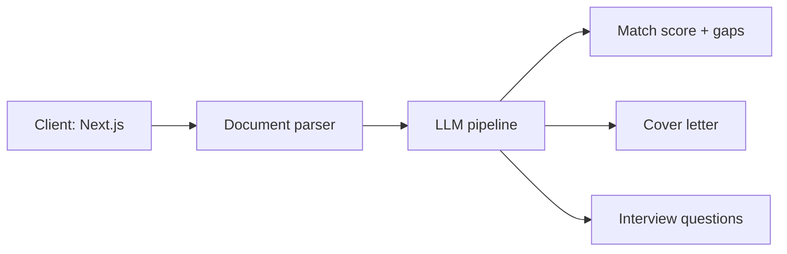

# Resume Buddy
 
**AI-powered career platform** — resume analysis, tailored cover letters, and interview prep, generated in under 60 seconds.
 
🔗 **Live:** [nexlifypal.com](https://www.nexlifypal.com)
 
<!-- TODO: Add 2-3 screenshots or a short GIF of the core flow (upload → match score → suggestions). This is the most important element of this page.

-->
 
> ⚠️ This repository documents the product — the source code is private. If you'd like to discuss the implementation in detail, [get in touch](mailto:ignatovich.dm@gmail.com).
 
## What It Does
 
Job seekers upload a CV (PDF, DOCX, or TXT), paste a job description, and get a complete application kit:
 
- 📊 **ATS match score** — how well the CV matches the specific job posting, with missing keywords highlighted
- 🔍 **Gap analysis** — concrete issues (missing metrics, generic summary lines) with suggested rewrites based on the user's actual experience
- ✉️ **Tailored cover letter** — a one-page draft built from the CV and the job post
- 🎤 **Interview prep** — role-specific questions with suggested answers derived from the user's background
- 📈 **Job market trends** — insights from real job postings feed into the tailoring
- 🌍 **Multi-language support**
 
## Tech Stack
 
<!-- TODO: verify/correct this table — I've marked my guesses -->
 
| Layer | Technology |
|---|---|
| Frontend | Next.js (App Router), TypeScript, Tailwind CSS |
| AI | LLM API integration OpenAI + Claude |
| Document parsing | PDF / DOCX / TXT extraction <!-- TODO: which libs --> |
| Backend & data | Firebase |
| i18n | Multi-language routing (`/en`, ...) |
| Hosting | Vercel |
| Payments | Stripe |
 
## Interesting Problems I Solved
 
<!-- TODO: This section is what turns a showcase into an interview magnet. Write 3-4 short paragraphs. Ideas based on what the product visibly does: -->
 
- **Parsing messy real-world resumes** — AI is searching for needed information inside resume
- **Scoring CV-to-job match** — keyword extraction, weighting + LLM 
- **Keeping generation under 60 seconds** — streaming + sending only necessary information 
- **Privacy by design** — resumes and generated content are not stored <!-- explain how the no-storage architecture works -->
## Architecture
 
<!-- TODO: add a simple diagram (Excalidraw/Mermaid) showing: client → parsing → LLM pipeline → response. Even a basic one significantly boosts credibility. -->
 

 
## What's Next
 
<!-- TODO: 2-3 roadmap items, e.g. LinkedIn import, team/coach accounts, more languages -->
- **LinkedIn Profile import**
---
 
Built by [Dzmitry Ihnatovich](https://github.com/guestDI) · [LinkedIn](https://www.linkedin.com/in/dzmitry-ihnatovich-096b8a36)
